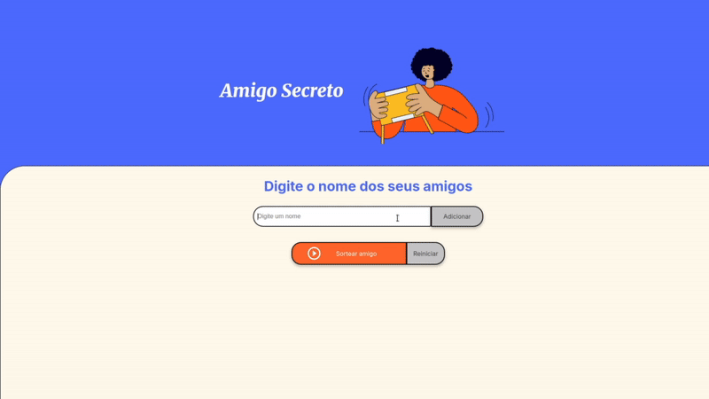

<h1 align="center" style="font-weight: bold;"> Amigo secreto 🤫🎁</h1>


<p align="center">
 <a href="#features">Funcionalidades</a> • 
 <a href="#tech">Tecnologias</a> • 
 <a href="#requirements">Pré-requisitos</a> • 
 <a href="#application">Como rodar a aplicação</a> •
 <a href="#contribute">Desenvolvedor(es)</a> • 
 <a href="#access">Disponível em</a> • 
 <a href="#license">Licença</a>
</p>

<p align="center">
    <b>Bem-vindo à sua ferramenta de Amigo Secreto digital! Aqui você adiciona os nomes dos amigos, evita duplicatas automaticamente e sorteia de forma totalmente aleatória. <br/> Perfeito para deixar a brincadeira mais divertida e organizada — sem papel, sem confusão! 😉</b>
</p>

---

<h2 id="layout">🎨 Layout</h2>

<p align="center">
        
</p>

---

<h2 id="features">🧰 Funcionalidades</h2>

### 👥 Adição de Participantes

* **Campo Intuitivo:** Adiciona nomes de forma simples.
* **Validação Inteligente:** O sistema valida a entrada de nomes para garantir que não haja campos vazios ou nomes inválidos.
* **Controle de Duplicidade:** Alertas informam se um nome já foi adicionado, prevenindo entradas duplicadas na lista.

### 📝 Lista Dinâmica

* **Atualização em Tempo Real:** A lista de amigos é atualizada instantaneamente a cada adição ou remoção.
* **Estado Visual:** Embora não haja marcação visual de "sorteado" no momento (como riscado ou selo), a lista é limpa e o nome sorteado é exibido em destaque no resultado.

### 🎲 Sorteio Aleatório

* **Escolha Imparcial:** O sorteio é feito de forma totalmente aleatória entre os amigos ainda não sorteados.
* **Nome em Destaque:** O nome do amigo secreto sorteado é exibido de forma clara.
* **Sem Repetições:** O mesmo amigo não será sorteado mais de uma vez na mesma rodada.

### 🙈 Ocultação do Resultado

* **Privacidade Garantida:** Após visualizar o nome sorteado, o usuário pode ocultá-lo clicando no botão "Ocultar Resultado", garantindo que ninguém mais veja acidentalmente.

* **Segurança Extra:** Além de esconder visualmente, o nome sorteado é removido do HTML, impedindo acesso até mesmo via inspeção de código.

* **Fluxo Controlado:** O botão de ocultar só aparece após o sorteio e é desativado automaticamente quando o resultado é escondido.

### ⚙️ Gerenciamento de Estado

* **Mensagens Dinâmicas:** O sistema fornece feedback contextual ao usuário, como alertas de validação e mensagens de conclusão do sorteio.
* **Botões Inteligentes:** Os botões "Sortear" e "Resetar" possuem estados inteligentes, sendo ativados ou desativados conforme o contexto. 

### 🔒 Reinício Seguro

* **Limpeza Completa:** A função de reiniciar limpa completamente o jogo, removendo todos os amigos adicionados e sorteados.
* **Nova Rodada:** Após o reset, a aplicação está pronto para uma nova rodada de Amigo Secreto!

---

<h2 id="tech">💻 Tecnologias</h2>

| Linguagem             | Finalidade                                                                |
| --------------------- | ------------------------------------------------------------------------- |
| **HTML5**             | Estrutura semântica da página do Amigo Secreto                            |
| **CSS3**              | Estilização com visual moderno e uso de cores vibrantes         |
| **JavaScript (ES6+)** | Lógica para adicionar amigos, sortear o amigo secreto e controlar estados |


---

<h2 id="requirements">Pré-requisitos</h2>

- [NodeJS](https://nodejs.org/pt)
- [Git](https://git-scm.com/downloads)
- Editor de código como [VSCode](https://code.visualstudio.com/)

---

<h2 id="application">Como rodar a aplicação ▶️</h2>

1. No terminal, clone o projeto:

```bash
git clone https://github.com/MiguelLuan/challeng-amigo-secreto.git
```

2. Abra a pasta do projeto:

```bash
cd  challeng-amigo-secreto
```

3. Agora abra o editor de código para editar:

```bash
code .
```

4. Abra no navergador,por meio do arquivo `index.html`.

5. Adicione os nomes dos amigos secretos, faça o sorteio e, se quiser, reinicie para começar de novo!

---

## 🗂️ Estrutura de pastas

```
.
├── assets/                  
│   ├── amigo-secreto.png     
│   ├── play-cicle_uotline.png            
│   └── tela-do-site.gif          
├── app.js                       
├── index.html                   
├── README.md                    
└── style.css         

```

---

<h2 id="contribute">🧑‍💻 Desenvolvedor(es)</h2>

| [<br><sub>Miguel Luan</sub>](https://github.com/MiguelLuan) |
| :---: 

---

<h2 id="access">🌐 Disponível em:</h2>

> Github Pages -> https://miguelluan.github.io/challeng-amigo-secreto/


---

<h2 id="license">📝 Licença</h3>

Este projeto esta sobe a licença [MIT](LICENSE).
